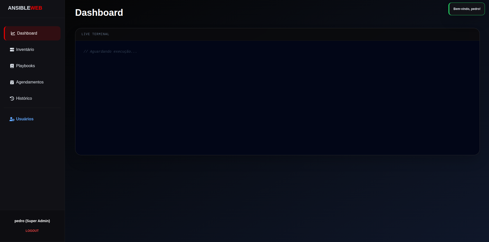

# 🚀 Ansible Web Dashboard - Bare Metal Edition



Uma interface web moderna, responsiva e robusta para orquestração de infraestrutura com **Ansible**. 

Este projeto foi desenvolvido para simplificar a execução e o acompanhamento de rotinas de DevOps, transformando operações complexas de CLI numa experiência visual intuitiva, mantendo o controlo total sobre os ficheiros nativos do sistema (/etc/ansible).

---

## 🎯 O Problema que Resolve
A gestão do Ansible exige habitualmente navegação constante pelo terminal, edição manual de inventários via `nano/vim` e memorização de comandos extensos. Este Dashboard atua como uma camada visual direta sobre o servidor, permitindo gerir playbooks, inventários e agendamentos pelo navegador, com logs colorizados em tempo real.

---

## ✨ Funcionalidades Principais

* **🔴 Live Terminal Streaming:** Captura a saída padrão (`stdout`) do Ansible no Linux e transmite para a interface web via Fetch API, mantendo a colorização inteligente (Ok, Changed, Fatal).
* **📂 Gestão de Inventário Nativa:** Integração direta com o ficheiro `/etc/ansible/hosts`. Permite adição via formulário ou edição RAW (colando ficheiros `.yml` ou `.ini`).
* **🎯 Execução Direcionada (`--limit`):** Possibilidade de filtrar a execução para um host ou grupo específico sem alterar o código do playbook.
* **⏰ Motor de Cron Visual:** Interface gráfica para agendamentos que gera expressões Cron automaticamente, eliminando erros de sintaxe.
* **🛡️ Controlo de Acesso (RBAC):** Sistema de autenticação com níveis de privilégio (User e Super Admin).

---

## 🛠️ Stack Tecnológica

* **Backend:** Python 3, Flask (API & Streaming), `python-dotenv`.
* **Base de Dados:** MySQL (Utilizadores, Histórico e Agendamentos).
* **Frontend:** HTML5, Tailwind CSS, JavaScript Vanilla.
* **Automação:** Ansible Core.

---

## 💾 Configuração da Base de Dados (MySQL)

Executa o script abaixo no teu MySQL para preparar o ambiente:

```sql
CREATE DATABASE IF NOT EXISTS ansible_web;
USE ansible_web;

-- Tabela de Utilizadores
CREATE TABLE IF NOT EXISTS users (
    id INT AUTO_INCREMENT PRIMARY KEY, 
    username VARCHAR(50) NOT NULL UNIQUE, 
    password VARCHAR(255) NOT NULL, 
    role VARCHAR(50) DEFAULT 'User'
);

-- Tabela de Histórico de Execuções
CREATE TABLE IF NOT EXISTS history (
    id INT AUTO_INCREMENT PRIMARY KEY, 
    user_name VARCHAR(50), 
    playbook_name VARCHAR(100), 
    status VARCHAR(20), 
    executed_at TIMESTAMP DEFAULT CURRENT_TIMESTAMP
);

-- Tabela de Agendamentos (Cron)
CREATE TABLE IF NOT EXISTS schedules (
    id INT AUTO_INCREMENT PRIMARY KEY, 
    playbook_name VARCHAR(100), 
    cron_expression VARCHAR(50), 
    description VARCHAR(255), 
    active BOOLEAN DEFAULT TRUE, 
    created_at TIMESTAMP DEFAULT CURRENT_TIMESTAMP
);

-- Utilizador Administrador Padrão
INSERT IGNORE INTO users (username, password, role) VALUES ('admin', 'admin123', 'Super Admin');

```
# 🚀 Instalação e Execução

## 1️⃣ Permissões de Sistema

É necessário garantir que o utilizador que executa a aplicação tem permissão nos diretórios do Ansible:

```bash
sudo chown -R $USER:$USER /etc/ansible/playbooks
sudo chown $USER:$USER /etc/ansible/hosts
```

---

## 2️⃣ Configuração do Ambiente

```bash
# Clone o repositório
git clone https://github.com/pedrinngkl/ansible_web_dasboard.git
cd ansible_web_dasboard

# Criar e ativar ambiente virtual
python3 -m venv venv
source venv/bin/activate

# Instalar dependências
pip install flask flask-cors mysql-connector-python python-dotenv
```

---

## 3️⃣ Variáveis de Ambiente (.env)

Crie um ficheiro `.env` na raiz do projeto para proteger as suas credenciais:

```env
DB_USER=teu_utilizador
DB_PASSWORD=tua_senha
DB_HOST=localhost
DB_NAME=ansible_web
```

---

## 4️⃣ Execução como Serviço (Systemd)

Para manter o painel sempre ativo no Linux, crie o ficheiro:

```
/etc/systemd/system/ansible-web.service
```

Com o seguinte conteúdo:

```ini
[Unit]
Description=Ansible Web Dashboard
After=network.target mysql.service

[Service]
User=construinfra
WorkingDirectory=/home/construinfra/ansible-portfolio
ExecStart=/home/construinfra/ansible-portfolio/venv/bin/python server.py
Restart=always

[Install]
WantedBy=multi-user.target
```

### 🔧 Comandos do serviço

```bash
sudo systemctl daemon-reload
sudo systemctl enable ansible-web
sudo systemctl start ansible-web
```

---

# 👨‍💻 Sobre o Autor

Desenvolvido por **Pedro Gonçalves**.

Atuo como estagiário na área de **DevOps e Infraestrutura**.

Focado em automação de sistemas Linux, redes e no desenvolvimento de ferramentas que otimizam a operação de TI através de código.
